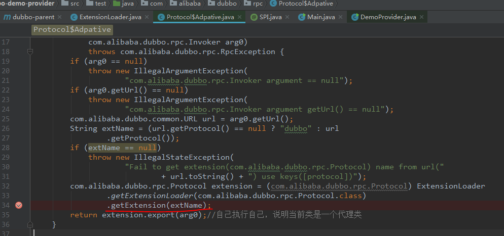
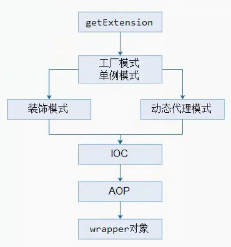

## Dubbo Spi机制分析

### 一、Dubbo内核

Dubbo内核主要包含SPI、AOP、IOC、Compiler。

### 二、JDK的SPI

1.spi的设计目标： 

面向对象的设计里，模块之间是基于接口编程，模块质检不对实现类进行硬编码。一旦代码里涉及具体的实现类，就违反了可插拔的原则，如果需要替换一种实现，就需要修改代码。为了实现在模块装配的时候，不在模块里写死代码，就需要一种服务发现机制。Java SPI就提供了这样一种机制：为某个接口寻找服务实现，有点类似IOC思想，将装配的控制权移到代码之外。

2.JDK的SPI的默认约定

当服务的提供者提供了一个接口的多种实现时，一般会在jar包的META-INF/services目录下，创建该接口的同名文件，文件的内容就是该服务接口的具体实现类的全类名。

### 三、Dubbo为什么不采用JDK的SPI

JDK标准的SPI会一次性实例化扩展点所有实现，如果有扩展实现初始化很耗时。但如果没用上也加载，会很浪费资源。针对这个问题，Dubbo增加了对扩展点IoC和AOP的支持，一个扩展点可以直接setter注入其它扩展点。

### 四、Dubbo SPI的默认约定

1.spi 文件存储路径在META-INF\dubbo\internal 目录下并且文件名为接口的全路径名。即接口文件的全类名。

2.每个spi 文件里面的格式定义为： 扩展名=具体的类名，例如 dubbo=com.alibaba.dubbo.rpc.protocol.dubbo.DubboProtoco。使用时通过key加载（如dubbo），可以实现部分加载。

### 五、SPI示例

遵循上述第一条第2点，这里Command为接口文件，其中StartCommand和ShutdownCommand为两个实现类。需要在resources目录下建META-INF子目录，在META-INF下建services目录，然后以接口全路径作为文件名创建文件，内容为接口实现类的全类型名。

Command.java

```java
package com.dongqiang.soa.spi;
/**
 * Created by qiangdong on 2018/2/2.
 */
public interface Command {
    void execute();
}
```

StartCommand.java

```java
package com.dongqiang.soa.spi;
/**
 * Created by qiangdong on 2018/2/2.
 */
public class StartCommand implements Command {
@Override
    public void execute() {
        System.out.println("start command.");
    }
}
```

ShutdownCommand.java

```java
package com.dongqiang.soa.spi;
/**
 * Created by qiangdong on 2018/2/2.
 */
public class ShutdownCommand implements Command {

    @Override
    public void execute() {
        System.out.println("ShutdownCommand");
    }
}
```

Main类：

```java
package com.dongqiang.soa.spi;
import java.util.ServiceLoader;

/**
 * Created by qiangdong on 2018/2/2.
 */
public class Main {

    public static void main(String[] args) {
        ServiceLoader<Command> serviceLoader = ServiceLoader.load(Command.class);

        for (Command command : serviceLoader) {
            command.execute();
        }
    }
}
```

### 六、结合Dubbo源码分析Spi

如前所说，Dubbo SPI的目的是获取一个指定实现类的对象。那么Dubbo是通过什么方式获取的呢？其实是调用ExtensionLoader.getExtension(String name)实现。

具体实现途径有三种：

①getExtensionLoader(Class<T> type)    为type接口new一个ExtensionLoader，然后缓存起来。

②getAdaptiveExtension()   获取一个扩展装饰类的对象，这个类有一个规则，如果它没有@Adaptive注解，就动态创建一个装饰类，例如Protocol$Adaptive对象。

③getExtension(String name)    获取一个指定对象。

（1）分析ExtensionLoader.getExtensionLoader(Class<T> type)

Dubbo的第一行代码在哪里？

idea导入Dubbo源码，在子模块dubbo-demo-provider/src/test下有DemoProvider.java

```java
package com.alibaba.dubbo.demo.provider;

public class DemoProvider {

    public static void main(String[] args) {
        com.alibaba.dubbo.container.Main.main(args);
    }
}
```

这里便是代码的入口。

这里调到com.alibaba.dubbo.container.Main.java

```java
package com.alibaba.dubbo.container;

import com.alibaba.dubbo.common.Constants;
import com.alibaba.dubbo.common.extension.ExtensionLoader;
import com.alibaba.dubbo.common.logger.Logger;
import com.alibaba.dubbo.common.logger.LoggerFactory;
import com.alibaba.dubbo.common.utils.ConfigUtils;

import java.text.SimpleDateFormat;
import java.util.ArrayList;
import java.util.Arrays;
import java.util.Date;
import java.util.List;

/**
 * Main. (API, Static, ThreadSafe)
 *
 * @author william.liangf
 */
public class Main {

    public static final String CONTAINER_KEY = "dubbo.container";

    public static final String SHUTDOWN_HOOK_KEY = "dubbo.shutdown.hook";

    private static final Logger logger = LoggerFactory.getLogger(Main.class);

    private static final ExtensionLoader<Container> loader = ExtensionLoader.getExtensionLoader(Container.class);

    private static volatile boolean running = true;

    public static void main(String[] args) {
        try {
            if (args == null || args.length == 0) {
                String config = ConfigUtils.getProperty(CONTAINER_KEY, loader.getDefaultExtensionName());
                args = Constants.COMMA_SPLIT_PATTERN.split(config);
            }

            final List<Container> containers = new ArrayList<Container>();
            for (int i = 0; i < args.length; i++) {
                containers.add(loader.getExtension(args[i]));
            }
            logger.info("Use container type(" + Arrays.toString(args) + ") to run dubbo serivce.");

            if ("true".equals(System.getProperty(SHUTDOWN_HOOK_KEY))) {
                Runtime.getRuntime().addShutdownHook(new Thread() {
                    public void run() {
                        for (Container container : containers) {
                            try {
                                container.stop();
                                logger.info("Dubbo " + container.getClass().getSimpleName() + " stopped!");
                            } catch (Throwable t) {
                                logger.error(t.getMessage(), t);
                            }
                            synchronized (Main.class) {
                                running = false;
                                Main.class.notify();
                            }
                        }
                    }
                });
            }

            for (Container container : containers) {
                container.start();
                logger.info("Dubbo " + container.getClass().getSimpleName() + " started!");
            }
            System.out.println(new SimpleDateFormat("[yyyy-MM-dd HH:mm:ss]").format(new Date()) + " Dubbo service server started!");
        } catch (RuntimeException e) {
            e.printStackTrace();
            logger.error(e.getMessage(), e);
            System.exit(1);
        }
        synchronized (Main.class) {
            while (running) {
                try {
                    Main.class.wait();
                } catch (Throwable e) {
                }
            }
        }
    }

}
```

可以看到，Main类中定义了一系列的静态成员变量，其中：

```java
private static final ExtensionLoader<Container> loader = ExtensionLoader.getExtensionLoader(Container.class);
```

在Main类初始化阶段调用了上述第①条方式为Container创建扩展点。

通过断点跟进getExtensionLoader方法，会进行new ExtensionLoader<T>(type)构造：

```java
private ExtensionLoader(Class<?> type) {
        this.type = type;
        objectFactory = (type == ExtensionFactory.class ? null : ExtensionLoader.getExtensionLoader(ExtensionFactory.class).getAdaptiveExtension());
    }
```

可以看到，这里会进一步调用getExtensionLoader方法，只是这次传入的是ExtensionFactory.class。通过上面的代码知道，等价于如下：

```java
this.type = type;
objectFactory = null;
```

执行以上代码完成了2个属性的初始化：

1.每个ExtensionLoader都包含了2个值： type 和 objectFactory

  Class<?> type；//构造器初始化时要得到的接口名

  ExtensionFactory objectFactory//构造器初始化时设置为AdaptiveExtensionFactory，Dubbo内部默认的实现是SpiExtensionFactory和SpringExtensionFactory。

2.new 一个ExtensionLoader 存储在ConcurrentMap<Class<?>, ExtensionLoader<?>> EXTENSION_LOADERS里。

**关于objectFactory**

1.objectFactory就是ExtensionFactory，它也是通过ExtensionLoader.getExtensionLoader(ExtensionFactory.class)来实现的，但是它的objectFactory=null

2.objectFactory作用，它就是为dubbo的IOC提供所有对象。

（2）分析getAdaptiveExtension()

为什么要设计Adaptive？

Adaptive注解在类和方法上有什么区别？

①注解在类上，代表人工实现编码，即实现了一个装饰类，如ExtensionFactory。

②注解在方法上，代表自动生成和编译一个动态的adaptive类，如Protocol$Adaptive。

接下来从子模块dubbo-config-spring下的schema包的DubboNamespaceHandler开始分析：

```java
package com.alibaba.dubbo.config.spring.schema;

import com.alibaba.dubbo.common.Version;
import com.alibaba.dubbo.config.ApplicationConfig;
import com.alibaba.dubbo.config.ConsumerConfig;
import com.alibaba.dubbo.config.ModuleConfig;
import com.alibaba.dubbo.config.MonitorConfig;
import com.alibaba.dubbo.config.ProtocolConfig;
import com.alibaba.dubbo.config.ProviderConfig;
import com.alibaba.dubbo.config.RegistryConfig;
import com.alibaba.dubbo.config.spring.AnnotationBean;
import com.alibaba.dubbo.config.spring.ReferenceBean;
import com.alibaba.dubbo.config.spring.ServiceBean;

import org.springframework.beans.factory.xml.NamespaceHandlerSupport;

/**
 * DubboNamespaceHandler
 *
 * @author william.liangf
 * @export
 */
public class DubboNamespaceHandler extends NamespaceHandlerSupport {

    static {
        Version.checkDuplicate(DubboNamespaceHandler.class);
    }

    public void init() {
        registerBeanDefinitionParser("application", new DubboBeanDefinitionParser(ApplicationConfig.class, true));
        registerBeanDefinitionParser("module", new DubboBeanDefinitionParser(ModuleConfig.class, true));
        registerBeanDefinitionParser("registry", new DubboBeanDefinitionParser(RegistryConfig.class, true));
        registerBeanDefinitionParser("monitor", new DubboBeanDefinitionParser(MonitorConfig.class, true));
        registerBeanDefinitionParser("provider", new DubboBeanDefinitionParser(ProviderConfig.class, true));
        registerBeanDefinitionParser("consumer", new DubboBeanDefinitionParser(ConsumerConfig.class, true));
        registerBeanDefinitionParser("protocol", new DubboBeanDefinitionParser(ProtocolConfig.class, true));
        registerBeanDefinitionParser("service", new DubboBeanDefinitionParser(ServiceBean.class, true));
        registerBeanDefinitionParser("reference", new DubboBeanDefinitionParser(ReferenceBean.class, false));
        registerBeanDefinitionParser("annotation", new DubboBeanDefinitionParser(AnnotationBean.class, true));
    }
}
```

先来看

```java
registerBeanDefinitionParser("service", new DubboBeanDefinitionParser(ServiceBean.class, true));
```

这里ServiceBean继承自ServiceConfig类。

```java
public class ServiceConfig<T> extends AbstractServiceConfig {

    private static final long serialVersionUID = 3033787999037024738L;

    private static final Protocol protocol = ExtensionLoader.getExtensionLoader(Protocol.class).getAdaptiveExtension();

    private static final ProxyFactory proxyFactory = ExtensionLoader.getExtensionLoader(ProxyFactory.class).getAdaptiveExtension();
....
}
```

在这里通过getAdaptiveExtension()获取protocol。

```java
-->getAdaptiveExtension()//为cachedAdaptiveInstance赋值
  -->createAdaptiveExtension()
    -->getAdaptiveExtensionClass()//该方法看出，如果是预定义的类就直接返回，不然动态生成适配类
      -->getExtensionClasses()//为cachedClasses 赋值
        -->loadExtensionClasses()
          -->loadFile(..)
      -->createAdaptiveExtensionClass()//自动生成和编译一个动态的adpative类，这个类是一个代理类
        -->ExtensionLoader.getExtensionLoader
                  (com.alibaba.dubbo.common.compiler.Compiler.class).getAdaptiveExtension()
        -->compiler.compile(code, classLoader)
    -->injectExtension()//作用：进入IOC的反转控制模式，实现了动态注入
```

**loadFile(..)方法的作用**：把SPI配置文件（如META-INF/dubbo/internal/com.alibaba.dubbo.rpc.Protocol）的内容，存储在缓存变量里。使用了四个缓存变量。

①缓存包含Adaptive注解的类

cachedAdaptiveClass 如果这个Class含有adaptive注解就赋值进去，如ExtensionFactory有，而Protocol没有。

②缓存无Adaptive注解的封装类

cachedWrapperClasses 只有当该class无adaptive注解，并且构造方法参数为目标接口(type，如Protocol)类型，如Protocol里的SPI就只有ProtocolFilterWrapper和ProtocolListenerWrapper能命中，如下例：

```java
public class ProtocolFilterWrapper implements Protocol {

    private final Protocol protocol;

    public ProtocolFilterWrapper(Protocol protocol) {
        if (protocol == null) {
            throw new IllegalArgumentException("protocol == null");
        }
        this.protocol = protocol;
    }
  。。。
}
```

③cachedActivates 剩下的包含Activate注解的类

④cachedName  剩下的类存储在该map中

在loadExtensionClasses()方法中，有三处loadFile()加载SPI文件：

```java
private Map<String, Class<?>> loadExtensionClasses() {
        final SPI defaultAnnotation = type.getAnnotation(SPI.class);
        if (defaultAnnotation != null) {
            String value = defaultAnnotation.value();
            if (value != null && (value = value.trim()).length() > 0) {
                String[] names = NAME_SEPARATOR.split(value);
                if (names.length > 1) {
                    throw new IllegalStateException("more than 1 default extension name on extension " + type.getName()
                            + ": " + Arrays.toString(names));
                }
                if (names.length == 1) cachedDefaultName = names[0];
            }
        }

        Map<String, Class<?>> extensionClasses = new HashMap<String, Class<?>>();
        loadFile(extensionClasses, DUBBO_INTERNAL_DIRECTORY);
        loadFile(extensionClasses, DUBBO_DIRECTORY);
        loadFile(extensionClasses, SERVICES_DIRECTORY);
        return extensionClasses;
    }
```

这里的三处loadFile()实际上起到真正作用的是第一个：路径为META-INF/dubbo/internal/，这个打开dubbo.jar即可看到，这里仍然看com.alibaba.dubbo.rpc.Protocol这个SPI文件：

```java
registry=com.alibaba.dubbo.registry.integration.RegistryProtocol
dubbo=com.alibaba.dubbo.rpc.protocol.dubbo.DubboProtocol
filter=com.alibaba.dubbo.rpc.protocol.ProtocolFilterWrapper
listener=com.alibaba.dubbo.rpc.protocol.ProtocolListenerWrapper
mock=com.alibaba.dubbo.rpc.support.MockProtocol
injvm=com.alibaba.dubbo.rpc.protocol.injvm.InjvmProtocol
rmi=com.alibaba.dubbo.rpc.protocol.rmi.RmiProtocol
hessian=com.alibaba.dubbo.rpc.protocol.hessian.HessianProtocol
com.alibaba.dubbo.rpc.protocol.http.HttpProtocol
com.alibaba.dubbo.rpc.protocol.webservice.WebServiceProtocol
thrift=com.alibaba.dubbo.rpc.protocol.thrift.ThriftProtocol
memcached=com.alibaba.dubbo.rpc.protocol.memcached.MemcachedProtocol
redis=com.alibaba.dubbo.rpc.protocol.redis.RedisProtocol
```

上面执行compile时，框架会自动生成如下Protocol$Adpative类代码:

```java
package com.alibaba.dubbo.rpc;

import com.alibaba.dubbo.common.extension.ExtensionLoader;

public class Protocol$Adpative implements com.alibaba.dubbo.rpc.Protocol {
	public void destroy() {
		throw new UnsupportedOperationException(
				"method public abstract void com.alibaba.dubbo.rpc.Protocol.destroy() of interface com.alibaba.dubbo.rpc.Protocol is not adaptive method!");
	}

	public int getDefaultPort() {
		throw new UnsupportedOperationException(
				"method public abstract int com.alibaba.dubbo.rpc.Protocol.getDefaultPort() of interface com.alibaba.dubbo.rpc.Protocol is not adaptive method!");
	}

	public com.alibaba.dubbo.rpc.Exporter export(
			com.alibaba.dubbo.rpc.Invoker arg0)
			throws com.alibaba.dubbo.rpc.RpcException {
		if (arg0 == null)
			throw new IllegalArgumentException(
					"com.alibaba.dubbo.rpc.Invoker argument == null");
		if (arg0.getUrl() == null)
			throw new IllegalArgumentException(
					"com.alibaba.dubbo.rpc.Invoker argument getUrl() == null");
		com.alibaba.dubbo.common.URL url = arg0.getUrl();
		String extName = (url.getProtocol() == null ? "dubbo" : url
				.getProtocol());
		if (extName == null)
			throw new IllegalStateException(
					"Fail to get extension(com.alibaba.dubbo.rpc.Protocol) name from url("
							+ url.toString() + ") use keys([protocol])");
		com.alibaba.dubbo.rpc.Protocol extension = (com.alibaba.dubbo.rpc.Protocol) ExtensionLoader
				.getExtensionLoader(com.alibaba.dubbo.rpc.Protocol.class)
				.getExtension(extName);
		return extension.export(arg0);//自己执行自己，说明当前类是一个代理类
	}

	public com.alibaba.dubbo.rpc.Invoker refer(java.lang.Class arg0,
			com.alibaba.dubbo.common.URL arg1)
			throws com.alibaba.dubbo.rpc.RpcException {
		if (arg1 == null)
			throw new IllegalArgumentException("url == null");
		com.alibaba.dubbo.common.URL url = arg1;
		String extName = (url.getProtocol() == null ? "dubbo" : url
				.getProtocol());
		if (extName == null)
			throw new IllegalStateException(
					"Fail to get extension(com.alibaba.dubbo.rpc.Protocol) name from url("
							+ url.toString() + ") use keys([protocol])");
		com.alibaba.dubbo.rpc.Protocol extension = (com.alibaba.dubbo.rpc.Protocol) ExtensionLoader
				.getExtensionLoader(com.alibaba.dubbo.rpc.Protocol.class)
				.getExtension(extName);
		return extension.refer(arg0, arg1);//自己执行自己，说明当前类是一个代理类
	}
}
```

其实就是根据如下模板生成的：

```java
package <扩展点接口所在包>;
 
public class <扩展点接口名>$Adpative implements <扩展点接口> {
    public <有@Adaptive注解的接口方法>(<方法参数>) {
        if(是否有URL类型方法参数?) 使用该URL参数
        else if(是否有方法类型上有URL属性) 使用该URL属性
        # <else 在加载扩展点生成自适应扩展点类时抛异常，即加载扩展点失败！>
         
        if(获取的URL == null) {
            throw new IllegalArgumentException("url == null");
        }
 
              根据@Adaptive注解上声明的Key的顺序，从URL获致Value，作为实际扩展点名。
               如URL没有Value，则使用缺省扩展点实现。如没有扩展点， throw new IllegalStateException("Fail to get extension");
 
               在扩展点实现调用该方法，并返回结果。
    }
 
    public <有@Adaptive注解的接口方法>(<方法参数>) {
        throw new UnsupportedOperationException("is not adaptive method!");
    }
}
```

总结起来，Dubbo的所有对象都是通过ExtensionLoader获取的，SPI是内核。

（3）分析getExtension(String name)

为了进一步分析代理类的扩展类对象生成过程，将Protocol$Adpative类手动创建到dubbo源码子模块dubbo-demo下的dubbo-demo-provider中，test目录下新建包com.alibaba.dubbo.rpc。然后将上述代码拷贝其中。

然后在getExtension(extName)这里设置断点：



通过断点跟踪，调用链如下：

```java
-->getExtension(String name) //指定对象缓存在cachedInstances；get出来的对象可能是wrapper对象，例如protocol就是ProtocolFilterWrapper和ProtocolListenerWrapper其中一个。
  -->createExtension(String name)
    -->getExtensionClasses() //前面已经分析过，就是使用loadFile读取文件并缓存
    -->injectExtension(T instance)//dubbo的IOC反转控制，就是从spi和spring里面提取对象赋值。
      -->objectFactory.getExtension(pt, property)//通过ExtensionFactory获取extension，有两种
        -->①SpiExtensionFactory.getExtension(type, name)
          -->ExtensionLoader.getExtensionLoader(type)
          -->loader.getAdaptiveExtension()
        -->②SpringExtensionFactory.getExtension(type, name)
          -->context.getBean(name)
    -->injectExtension((T) wrapperClass.getConstructor(type).newInstance(instance))//AOP的简单设计，这个地方如果前面的wrapperClasses缓存不空，那么就会执行这句代码，如Protocol中只有Filter和Listener，通过使用ProtocolFilterWrapper或ProtocolListenerWrapper的构造方法反射然后注入
```

通过上述分析，总结起来SPI getExtension()的执行流程及设计模式如下：




