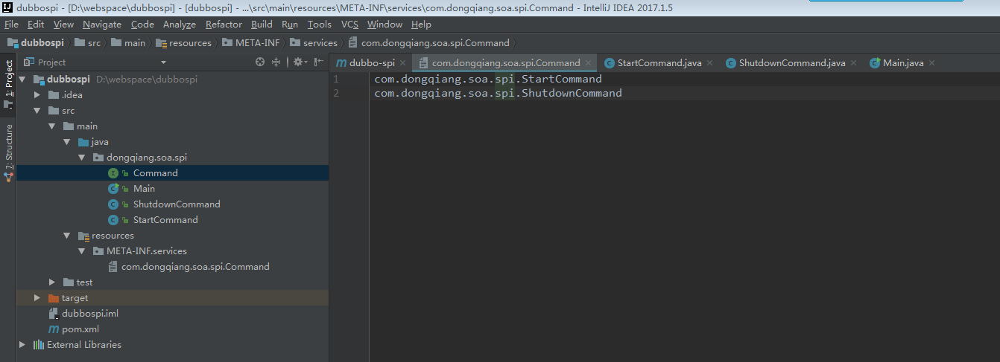

## Dubbo Spi机制分析

### 一、Dubbo内核

Dubbo内核主要包含SPI、AOP、IOC、Compiler。

### 二、JDK的SPI

1.spi的设计目标： 

面向对象的设计里，模块之间是基于接口编程，模块质检不对实现类进行硬编码。一旦代码里涉及具体的实现类，就违反了可插拔的原则，如果需要替换一种实现，就需要修改代码。为了实现在模块装配的时候，不在模块里写死代码，就需要一种服务发现机制。Java SPI就提供了这样一种机制：为某个接口寻找服务实现，有点类似IOC思想，将装配的控制权移到代码之外。

2.JDK的SPI的默认约定

当服务的提供者提供了一个接口的多种实现时，一般会在jar包的META-INF/services目录下，创建该接口的同名文件，文件的内容就是该服务接口的具体实现类的全类名。

### 三、Dubbo为什么不采用JDK的SPI

JDK标准的SPI会一次性实例化扩展点所有实现，如果有扩展实现初始化很耗时。但如果没用上也加载，会很浪费资源。针对这个问题，Dubbo增加了对扩展点IoC和AOP的支持，一个扩展点可以直接setter注入其它扩展点。

### 四、Dubbo SPI的默认约定

1.spi 文件存储路径在META-INF\dubbo\internal 目录下并且文件名为接口的全路径名。即接口文件的全类名。

2.每个spi 文件里面的格式定义为： 扩展名=具体的类名，例如 dubbo=com.alibaba.dubbo.rpc.protocol.dubbo.DubboProtoco。使用时通过key加载（如dubbo），可以实现部分加载。

### 五、SPI示例

遵循上述第一条第2点，这里Command为接口文件，其中StartCommand和ShutdownCommand为两个实现类。需要在resources目录下建META-INF子目录，在META-INF下建services目录，然后以接口全路径作为文件名创建文件，内容为接口实现类的全类型名。

Command.java

```java
package com.dongqiang.soa.spi;
/**
 * Created by qiangdong on 2018/2/2.
 */
public interface Command {
    void execute();
}
```

StartCommand.java

```java
package com.dongqiang.soa.spi;
/**
 * Created by qiangdong on 2018/2/2.
 */
public class StartCommand implements Command {
@Override
    public void execute() {
        System.out.println("start command.");
    }
}

```

ShutdownCommand.java

```java
package com.dongqiang.soa.spi;
/**
 * Created by qiangdong on 2018/2/2.
 */
public class ShutdownCommand implements Command {

    @Override
    public void execute() {
        System.out.println("ShutdownCommand");
    }
}
```

Main类：

```java
package com.dongqiang.soa.spi;
import java.util.ServiceLoader;

/**
 * Created by qiangdong on 2018/2/2.
 */
public class Main {

    public static void main(String[] args) {
        ServiceLoader<Command> serviceLoader = ServiceLoader.load(Command.class);

        for (Command command : serviceLoader) {
            command.execute();
        }
    }
}
```

