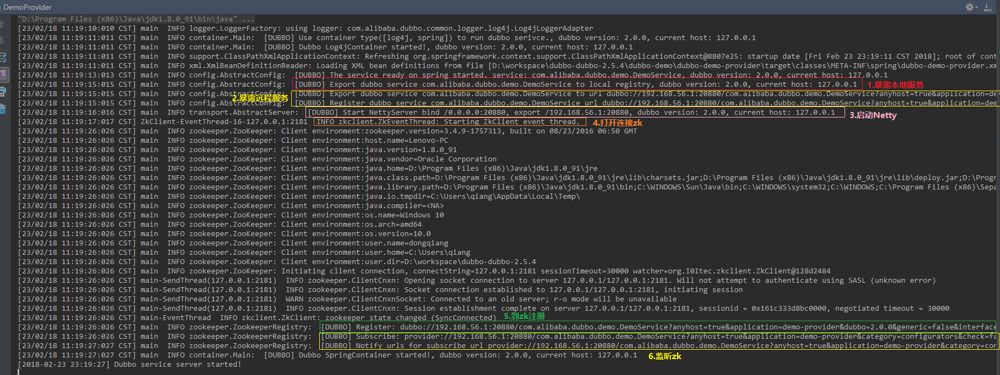

## Dubbo服务发布原理

修改dubbo-demo子项目的dubbo-demo-provider模块的dubbo-demo-provider.xml中注册中心的配置：

```xml
<!-- 使用multicast广播注册中心暴露服务地址 -->
<!--<dubbo:registry address="multicast://224.5.6.7:1234"/>-->
<dubbo:registry protocol="zookeeper" address="127.0.0.1:2181"/>
```

同时修改dubbo-config子项目的dubbo-config-spring模块的test/resources/dubbo.properties文件中：

```properties
#dubbo.registry.address=multicast://224.5.6.7:1234
dubbo.registry.address=zookeeper://127.0.0.1:2181
```

需要外部下载启动zookeeper组件。

然后启动dubbo-demo-provider/test/java下的DemoProvider观察服务启动日志：



从Provider启动日志可以看到，主要做了6个发布动作：

```
1.暴露本地服务
2.暴露远程服务
3.启动Netty
4.打开连接Zookeeper
5.到zookeeper注册
6.监听zookeeper
```

暴露的服务，其实就是dubbo-demo-provider.xml中配置的service：

```xml
<!-- 和本地bean一样实现服务 -->
<dubbo:service interface="com.alibaba.dubbo.demo.DemoService" ref="demoService"/>
```

dubbo:service是在dubbo-config-spring下resources/META-INF下的dubbo.xsd约束schema文件中定义的。

而处理Handler在dubbo-config-spring下的schema包下的DubboNamespaceHandler.java中处理：

```java
public class DubboNamespaceHandler extends NamespaceHandlerSupport {

    static {
        Version.checkDuplicate(DubboNamespaceHandler.class);
    }

    public void init() {
        registerBeanDefinitionParser("application", new DubboBeanDefinitionParser(ApplicationConfig.class, true));
        registerBeanDefinitionParser("module", new DubboBeanDefinitionParser(ModuleConfig.class, true));
        registerBeanDefinitionParser("registry", new DubboBeanDefinitionParser(RegistryConfig.class, true));
        registerBeanDefinitionParser("monitor", new DubboBeanDefinitionParser(MonitorConfig.class, true));
        registerBeanDefinitionParser("provider", new DubboBeanDefinitionParser(ProviderConfig.class, true));
        registerBeanDefinitionParser("consumer", new DubboBeanDefinitionParser(ConsumerConfig.class, true));
        registerBeanDefinitionParser("protocol", new DubboBeanDefinitionParser(ProtocolConfig.class, true));
        registerBeanDefinitionParser("service", new DubboBeanDefinitionParser(ServiceBean.class, true));
        registerBeanDefinitionParser("reference", new DubboBeanDefinitionParser(ReferenceBean.class, false));
        registerBeanDefinitionParser("annotation", new DubboBeanDefinitionParser(AnnotationBean.class, true));
    }
}
```

可以看到，service标签对应的Bean为ServiceBean。看看ServiceBean类继承关系：

```java
public class ServiceBean<T> extends ServiceConfig<T> implements InitializingBean, DisposableBean, ApplicationContextAware, ApplicationListener, BeanNameAware 
```

这里ServiceBean继承自ServiceConfig，并且实现了Spring框架的ApplicationListener接口。

```java
public interface ApplicationListener<E extends ApplicationEvent> extends EventListener {
    void onApplicationEvent(E var1);
}
```

所以在Spring框架启动时，会去回调执行ServiceBean的onApplicationEvent(e)方法。

```java
public void onApplicationEvent(ApplicationEvent event) {
        if (ContextRefreshedEvent.class.getName().equals(event.getClass().getName())) {
            if (isDelay() && !isExported() && !isUnexported()) {
                if (logger.isInfoEnabled()) {
                    logger.info("The service ready on spring started. service: " + getInterface());
                }
                export();
            }
        }
}
```

执行调用分析如下：

``` java
ServiceBean.onApplicationEvent
-->export()
  -->ServiceConfig.export()
    -->doExport()
      -->doExportUrls()//里面有一个for循环，代表了一个服务可以有多个通信协议，例如 tcp协议 http协议，默认是tcp协议
        -->loadRegistries(true)//从dubbo.properties里面组装registry的url信息：registry://127.0.0.1:2181/com.alibaba.dubbo.registry.RegistryService?application=demo-provider&dubbo=2.0.0&owner=william&pid=2752&registry=zookeeper&timestamp=1519438717974
        -->doExportUrlsFor1Protocol(ProtocolConfig protocolConfig, List<URL> registryURLs) 
```

这里分为本地暴露和远程暴露。那么暴露本地服务和暴露远程服务的区别是什么？

1.暴露本地服务：指暴露在用一个JVM里面，不用通过调用zk来进行远程通信。例如：在同一个服务，自己调用自己的接口，就没必要进行网络IP连接来通信。

2.暴露远程服务：指暴露给远程客户端的IP和端口号，通过网络来实现通信。

### 本地暴露

```java
//配置不是remote的情况下做本地暴露 (配置为remote，则表示只暴露远程服务)
          -->exportLocal(URL url) //本地暴露
            -->proxyFactory.getInvoker(ref, (Class) interfaceClass, local)
              -->ExtensionLoader.getExtensionLoader(com.alibaba.dubbo.rpc.ProxyFactory.class).getExtension("javassist");
              -->extension.getInvoker(arg0, arg1, arg2)
                -->StubProxyFactoryWrapper.getInvoker(T proxy, Class<T> type, URL url) 
                  -->proxyFactory.getInvoker(proxy, type, url)
                    -->JavassistProxyFactory.getInvoker(T proxy, Class<T> type, URL url)
                      -->Wrapper.getWrapper(com.alibaba.dubbo.demo.provider.DemoServiceImpl)
                        -->makeWrapper(Class<?> c)
                      -->return new AbstractProxyInvoker<T>(proxy, type, url)
            -->protocol.export(Invoker<T> invoker)
              -->Protocol$Adpative.export(Invoker<T> invoker)
                -->ExtensionLoader.getExtensionLoader(com.alibaba.dubbo.rpc.Protocol.class).getExtension("injvm");
                -->extension.export(arg0) //extension为ProtocolFilterWrapper
                  -->ProtocolFilterWrapper.export(Invoker<T> invoker)
                    -->ProtocolFilterWrapper.buildInvokerChain(final Invoker<T> invoker, String key, String group) //创建8个filter
                    -->ProtocolListenerWrapper.export(Invoker<T> invoker)
                      -->InjvmProtocol.export(Invoker<T> invoker)
                        -->return new InjvmExporter<T>(invoker, invoker.getUrl().getServiceKey(), exporterMap)
							-->exporterMap.put(key, this)//key=com.alibaba.dubbo.demo.DemoService, this=InjvmExporter //这里也是上面整个代码的目的，为了把要暴露的对象存储在exporterMap里
```

（1）这里的proxyFactory是什么？

```java
@SPI("javassist")
public interface ProxyFactory {
    /**
     * create proxy.
     *
     * @param invoker
     * @return proxy
     */
    @Adaptive({Constants.PROXY_KEY})
    <T> T getProxy(Invoker<T> invoker) throws RpcException;

    /**
     * create invoker.
     *
     * @param <T>
     * @param proxy
     * @param type
     * @param url
     * @return invoker
     */
    @Adaptive({Constants.PROXY_KEY})
    <T> Invoker<T> getInvoker(T proxy, Class<T> type, URL url) throws RpcException;
}
```

可以看出proxyFactory是一个代理，作用是获取一个接口的代理类，例如获取一个远程接口的代理。

 getInvoker：针对server端，将服务对象，如DemoServiceImpl包装成一个Invoker对象。

 getProxy：针对client端，创建接口的代理对象，例如DemoService的接口。

（2）上面还出现了Wrapper，这个又是做什么的？

它类似spring的BeanWrapper，它就是包装了一个接口或一个类，可以通过wrapper对实例对象进行赋值、取值以及指定方法的调用。

（3）Invoker

Invoker：它是一个可执行的对象，能够根据方法的名称、参数得到相应的执行结果。

```java
它里面有一个很重要的方法 Result invoke(Invocation invocation)，
Invocation是包含了需要执行的方法和参数等重要信息，目前它只有2个实现类RpcInvocation MockInvocation
它有3种类型的Invoker
	1.本地执行类的Invoker
		server端：要执行 demoService.sayHello，就通过InjvmExporter来进行反射执行demoService.sayHello就可以了。
		
	2.远程通信类的Invoker
		client端：要执行 demoService.sayHello，它封装了DubboInvoker进行远程通信，发送要执行的接口给server端。
		server端：采用了AbstractProxyInvoker执行了DemoServiceImpl.sayHello,然后将执行结果返回发送给client.
		
	3.多个远程通信执行类的Invoker聚合成集群版的Invoker
		client端：要执行 demoService.sayHello，就要通过AbstractClusterInvoker来进行负载均衡，DubboInvoker进行远程通信，发送要执行的接口给server端。
		server端：采用了AbstractProxyInvoker执行了DemoServiceImpl.sayHello,然后将执行结果返回发送给client.
```
### 远程暴露

远程暴露过程中使用Netty进行通信。接着前面分析：

```java
//如果配置不是local则暴露为远程服务.(配置为local，则表示只暴露本地服务)
          -->proxyFactory.getInvoker//原理和本地暴露一样都是为了获取一个Invoker对象
          -->protocol.export(invoker) //invoker: "registry://127.0.0.1:2181/com.alibaba.dubbo.registry.RegistryService?application=demo-provider&dubbo=2.0.0&export=dubbo%3A%2F%2F10.168.18.162%3A20880%2Fcom.alibaba.dubbo.demo.DemoService%3Fanyhost%3Dtrue%26application%3Ddemo-provider%26dubbo%3D2.0.0%26generic%3Dfalse%26interface%3Dcom.alibaba.dubbo.demo.DemoService%26loadbalance%3Droundrobin%26methods%3DsayHello%26owner%3Dwilliam%26pid%3D6948%26side%3Dprovider%26timestamp%3D1519691944112&owner=william&pid=6948&registry=zookeeper&timestamp=1519691944048"
            -->Protocol$Adpative.export(invoker)
              -->ExtensionLoader.getExtensionLoader(com.alibaba.dubbo.rpc.Protocol.class).getExtension("registry");
	            -->extension.export(arg0)
	              -->ProtocolFilterWrapper.export(Invoker<T> invoker)
	                -->ProtocolListenerWrapper.export(Invoker<T> invoker)
	                  -->RegistryProtocol.export(final Invoker<T> originInvoker)
	                    -->doLocalExport(final Invoker<T> originInvoker)
	                      -->getCacheKey(originInvoker);//读取 dubbo://127.0.0.1:20880/
	                      -->protocol.export(invokerDelegete)
	                        -->Protocol$Adpative.export(com.alibaba.dubbo.rpc.Invoker arg0)
	                          -->ExtensionLoader.getExtensionLoader(com.alibaba.dubbo.rpc.Protocol.class).getExtension("dubbo");
	                          -->extension.export(arg0)
	                            -->ProtocolFilterWrapper.export(Invoker<T> invoker)
	                              -->buildInvokerChain(invoker, Constants.SERVICE_FILTER_KEY, Constants.PROVIDER)//创建8个filter
	                              -->ProtocolListenerWrapper.export(Invoker<T> invoker)
                                    -->DubboProtocol.export(Invoker<T> invoker)  //------------1.netty服务暴露的开始
	                                  -->serviceKey(url)//组装key=com.alibaba.dubbo.demo.DemoService:20880
	                                  -->目的：exporterMap.put(key, exporter); //key=com.alibaba.dubbo.demo.DemoService:20880, exporter=DubboExporter
	                                  -->openServer(url)
	                                    -->createServer(url)
                                          -->Exchangers.bind(url, requestHandler)//------------2.信息交换层exchanger开始
	                                        -->getExchanger(url)
	                                          -->getExchanger(type)
	                                            -->ExtensionLoader.getExtensionLoader(Exchanger.class).getExtension("header")
	                                        -->HeaderExchanger.bind(URL url, ExchangeHandler handler)
	                                          -->Transporters.bind(url, new DecodeHandler(new HeaderExchangeHandler(handler)))
	                                            -->new HeaderExchangeHandler(handler)//this.handler = handler
	                                            -->new DecodeHandler
	                                            	-->new AbstractChannelHandlerDelegate//this.handler = handler;
                                                -->Transporters.bind(URL url, ChannelHandler... handlers)//----3.网络传输层 transporter
	                                              -->getTransporter()
	                                                -->ExtensionLoader.getExtensionLoader(Transporter.class).getAdaptiveExtension()
	                                              -->Transporter$Adpative.bind
	                                                -->ExtensionLoader.getExtensionLoader(com.alibaba.dubbo.remoting.Transporter.class).getExtension("netty");
	                                                -->extension.bind(arg0, arg1)
	                                                  -->NettyTransporter.bind(URL url, ChannelHandler listener)
	                                                    --new NettyServer(url, listener)
	                                                      -->AbstractPeer //this.url = url;    this.handler = handler;
	                                                      -->AbstractEndpoint//codec  timeout=1000  connectTimeout=3000
	                                                      -->AbstractServer //bindAddress accepts=0 idleTimeout=600000
                                                          -->doOpen()  //---------------4.打开连接，暴露netty服务
	                                                        -->设置 NioServerSocketChannelFactory boss worker的线程池 线程个数为3
	                                                        -->设置编解码 hander
	                                                        -->bootstrap.bind(getBindAddress())
	                                          -->new HeaderExchangeServer
	                                            -->this.server=NettyServer
	                                            -->heartbeat=60000
	                                            -->heartbeatTimeout=180000
	                                            -->startHeatbeatTimer()//这是一个心跳定时器，采用了线程池，如果断开就心跳重连。
```

①Protocol

1.export：暴露远程服务（用于服务端），就是将proxyFactory.getInvoker创建的代理类 invoker对象，通过协议暴露给外部。

2.refer：引用远程服务（用于客户端）， 通过proxyFactory.getProxy来创建远程的动态代理类，例如DemoService的远程动态接口。

②exporter：维护invoker的生命周期。

③exchanger：信息交换层，封装请求响应模式，同步转异步。

④transporter：网络传输层，用来抽象netty和mina的统一接口。


**接着前面Netty分析之后，来分析Dubbo中的Zookeeper使用机制。**

关注如下三个问题：

①dubbo如何连接zookeeper？

```java
	                    -->getRegistry(originInvoker)//连接zookeeper
	                      -->registryFactory.getRegistry(registryUrl)
	                        -->ExtensionLoader.getExtensionLoader(RegistryFactory.class).getExtension("zookeeper");
	                        -->extension.getRegistry(arg0)
	                          -->AbstractRegistryFactory.getRegistry//创建一个注册中心，存储在REGISTRIES
	                            -->createRegistry(url)
	                              -->new ZookeeperRegistry(url, zookeeperTransporter)
	                                -->AbstractRegistry(URL url)
	                                  -->loadProperties()//目的：把C:\Users\qiangdong\.dubbo\dubbo-registry-127.0.0.1.cache 文件中的内容加载为properties
	                                  -->notify(url.getBackupUrls())//不做任何事             
	                                -->FailbackRegistry   
	                                  -->retryExecutor.scheduleWithFixedDelay(new Runnable()//建立线程池，检测并连接注册中心,如果失败了就重连
	                                -->ZookeeperRegistry
	                                  -->zookeeperTransporter.connect(url)
	                                    -->ZookeeperTransporter$Adpative.connect(url)
	                                      -->ExtensionLoader.getExtensionLoader(ZookeeperTransporter.class).getExtension("zkclient");
	                                      -->extension.connect(arg0)
	                                        -->ZkclientZookeeperTransporter.connect(URL url)
	                                          -->new ZkclientZookeeperClient(url)
	                                            -->调用super: AbstractZookeeperClient(URL url)
												-->new ZkClient(url.getBackupAddress());//连接ZK
	                                            -->client.subscribeStateChanges(new IZkStateListener()//订阅的目的：连接断开时重连
	                                  -->zkClient.addStateListener(new StateListener() 
	                                    -->recover //连接失败时重连
```

②dubbo如何创建zookeeper节点？

```java
	                    -->registry.register(registedProviderUrl)//创建节点
	                      -->AbstractRegistry.register
	                      -->FailbackRegistry.register
	                        -->doRegister(url)//向zk服务器端发送注册请求
	                          -->ZookeeperRegistry.doRegister(URL url)
	                            -->zkClient.create(toUrlPath(url), url.getParameter(Constants.DYNAMIC_KEY, true))
	                              -->AbstractZookeeperClient.create///dubbo/com.alibaba.dubbo.demo.DemoService/providers/dubbo%3A%2F%2F10.168.18.162%3A20880%2Fcom.alibaba.dubbo.demo.DemoService%3Fanyhost%3Dtrue%26application%3Ddemo-provider%26dubbo%3D2.0.0%26generic%3Dfalse%26interface%3Dcom.alibaba.dubbo.demo.DemoService%26loadbalance%3Droundrobin%26methods%3DsayHello%26owner%3Dwilliam%26pid%3D7832%26side%3Dprovider%26timestamp%3D1519804577146
	                                -->createEphemeral(path);//临时节点  dubbo%3A%2F%2F10.168.18.162%3A20880%2F.............
	                                -->createPersistent(path);//持久化节点 dubbo/com.alibaba.dubbo.demo.DemoService/providers
```

zk持久化节点和临时节点有什么区别？

持久化节点：一旦被创建，除非主动删除掉，否则就一直存储在zk里面。

临时节点：与客户端会话绑定，一旦客户端会话失效，这个客户端端所创建的所有临时节点都会被删除。Dubbo对注册的服务使用临时节点，保证服务断掉时节点自动被移除，以免订阅者一直订阅。

③dubbo如何订阅zookeeper信息？

```

```


