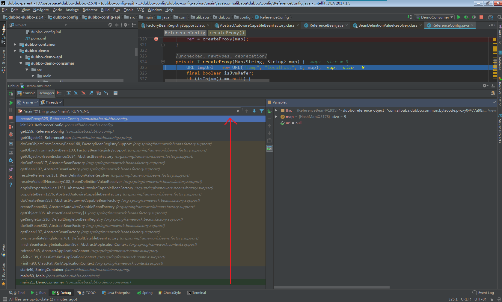
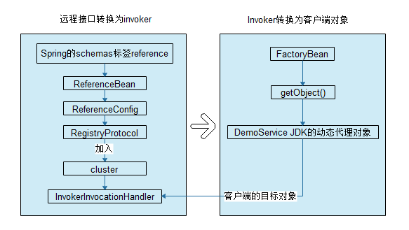

## Dubbo服务引用的设计原理

首先为了分析服务引用的过程， 需要在源码中修改注册中心的地址如下：

dubbo-demo项目的dubbo-demo-consumer/src/test/resources/dubbo.properties

```properties
#dubbo.registry.address=multicast://224.5.6.7:1234
dubbo.registry.address=zookeeper://127.0.0.1:2181
```

dubbo-demo项目的dubbo-demo-consumer/src/main/resources/META-INF/spring/dubbo-demo-consumer.xml

```xml
<!-- 使用multicast广播注册中心暴露发现服务地址 -->
<!--<dubbo:registry address="multicast://224.5.6.7:1234"/>-->
<dubbo:registry protocol="zookeeper" address="127.0.0.1:2181"/>
```

使用两个Idea，分别运行producer和consumer。其中consumer用来断点跟踪。



消费者代码入口代码为：

```java
public class DemoConsumer {
    public static void main(String[] args) {
        com.alibaba.dubbo.container.Main.main(args);
    }
}
```

根据dubbo-demo-consumer.xml

```xml
<!-- 生成远程服务代理，可以和本地bean一样使用demoService -->
    <dubbo:reference id="demoService" check="false" interface="com.alibaba.dubbo.demo.DemoService"/>
```

reference标签定义的名称空间代码：

```java
public class DubboNamespaceHandler extends NamespaceHandlerSupport {

    static {
        Version.checkDuplicate(DubboNamespaceHandler.class);
    }

    public void init() {
        registerBeanDefinitionParser("application", new DubboBeanDefinitionParser(ApplicationConfig.class, true));
        registerBeanDefinitionParser("module", new DubboBeanDefinitionParser(ModuleConfig.class, true));
        registerBeanDefinitionParser("registry", new DubboBeanDefinitionParser(RegistryConfig.class, true));
        registerBeanDefinitionParser("monitor", new DubboBeanDefinitionParser(MonitorConfig.class, true));
        registerBeanDefinitionParser("provider", new DubboBeanDefinitionParser(ProviderConfig.class, true));
        registerBeanDefinitionParser("consumer", new DubboBeanDefinitionParser(ConsumerConfig.class, true));
        registerBeanDefinitionParser("protocol", new DubboBeanDefinitionParser(ProtocolConfig.class, true));
        registerBeanDefinitionParser("service", new DubboBeanDefinitionParser(ServiceBean.class, true));
        registerBeanDefinitionParser("reference", new DubboBeanDefinitionParser(ReferenceBean.class, false));
        registerBeanDefinitionParser("annotation", new DubboBeanDefinitionParser(AnnotationBean.class, true));
    }
}
```

可以看到具体实现为ReferenceBean.java

```java
public class ReferenceBean<T> extends ReferenceConfig<T> implements FactoryBean, ApplicationContextAware, InitializingBean, DisposableBean {

```

ReferenceBean继承自ReferenceConfig，同时实现了InitializingBean。

```java
public interface InitializingBean {
    void afterPropertiesSet() throws Exception;
}
```

那么Spring初始化会调用到ReferenceBean类的afterPropertiesSet()，在该方法中调用getObject()：

```java
public Object getObject() throws Exception {
    return get();
}
```

接着调用到ReferenceConfig：

```java
public synchronized T get() {
        if (destroyed) {
            throw new IllegalStateException("Already destroyed!");
        }
        if (ref == null) {
            init();
        }
        return ref;
}
```

接下来开始分析Dubbo的引用流程：

```java
ReferenceBean.getObject()
  -->ReferenceConfig.get()
    -->init()
      -->createProxy(map)
        -->refprotocol.refer(interfaceClass, urls.get(0))
          -->ExtensionLoader.getExtensionLoader(Protocol.class).getExtension("registry");
          -->extension.refer(arg0, arg1);
            -->ProtocolFilterWrapper.refer(Class<T> type, URL url)
			  -->ProtocolListenerWrapper.refer(Class<T> type, URL url)
				  -->RegistryProtocol.refer(Class<T> type, URL url)
					-->registryFactory.getRegistry(url)//建立zk的连接，和服务端发布一样，省略
					-->doRefer(cluster, registry, type, url)
					  -->FailbackRegistry.register(URL url)//创建zk的节点
						-->ZookeeperRegistry.doRegister(URL url)
							-->zkClient.create(toUrlPath(url), url.getParameter(Constants.DYNAMIC_KEY, true)); //节点名为：dubbo/com.alibaba.dubbo.demo.DemoService/consumers
							....其余参见服务发布代码
					  -->registry.subscribe//订阅zk的节点，和服务端发布一样(省略代码)。   /dubbo/com.alibaba.dubbo.demo.DemoService/providers, /dubbo/com.alibaba.dubbo.demo.DemoService/configurators, /dubbo/com.alibaba.dubbo.demo.DemoService/routers]
						-->notify(url, listener, urls);
						  -->FailbackRegistry.notify(URL url, NotifyListener listener, List<URL> urls)
							-->doNotify(url, listener, urls);
							  -->AbstractRegistry.notify(URL url, NotifyListener listener, List<URL> urls)
								-->saveProperties(url);//把服务端的注册url信息更新到C:\Users\qiangdong\.dubbo\dubbo-registry-127.0.0.1.cache
								  -->registryCacheExecutor.execute(new SaveProperties(version));//采用线程池来处理
								-->listener.notify(categoryList)
								  -->RegistryDirectory.notify
									-->refreshInvoker(invokerUrls)//刷新缓存中的invoker列表
									  -->destroyUnusedInvokers(oldUrlInvokerMap,newUrlInvokerMap); // 关闭未使用的Invoker
									  -->最终目的：刷新Map<String, Invoker<T>> urlInvokerMap 对象 刷新Map<String, List<Invoker<T>>> methodInvokerMap对象
					  -->cluster.join(directory)//加入集群路由
						-->ExtensionLoader.getExtensionLoader(com.alibaba.dubbo.rpc.cluster.Cluster.class).getExtension("failover");
						  -->MockClusterWrapper.join(Directory<T> directory)
							-->this.cluster.join(directory)
							  -->FailoverCluster.join(Directory<T> directory)
								-->return new FailoverClusterInvoker<T>(directory)
								-->new MockClusterInvoker(Directory<T> directory, Invoker<T> invoker)
        -->proxyFactory.getProxy(invoker)//创建服务代理
          -->ProxyFactory$Adpative.getProxy
            -->ExtensionLoader.getExtensionLoader(com.alibaba.dubbo.rpc.ProxyFactory.class).getExtension("javassist");
              -->StubProxyFactoryWrapper.getProxy(Invoker<T> invoker)
                -->proxyFactory.getProxy(invoker)
                  -->AbstractProxyFactory.getProxy(Invoker<T> invoker)
                    -->JavassistProxyFactory.getProxy(invoker, interfaces)
					  -->return (T) Proxy.getProxy(interfaces).newInstance(new InvokerInvocationHandler(invoker))，即：
						  -->Proxy.getProxy(interfaces)//代理对象interfaces为：com.alibaba.dubbo.demo.DemoService, interface com.alibaba.dubbo.rpc.service.EchoService
						  -->InvokerInvocationHandler //采用jdk自带的InvocationHandler，创建InvokerInvocationHandler对象。
```

服务引用的代码中，对于连接注册与订阅zk的流程和服务发布是一致的。

```java
public class DemoAction {

    private DemoService demoService;

    public void setDemoService(DemoService demoService) {
        this.demoService = demoService;
    }
    。。。
}

String hello = demoService.sayHello("world" + i);
```

Spring框架最终将invoker转换为demoService对象。

通过流程图将关键节点描述如下：




