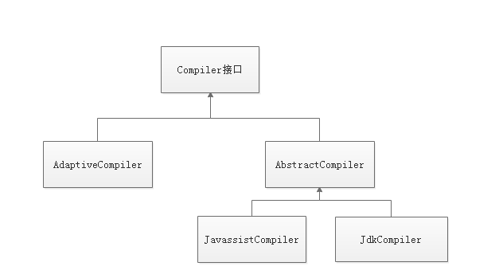

## Dubbo的动态编译

前面分析SPI机制时，提到createAdaptiveExtensionClass()自动生成和编译一个动态的adpative类。

Compiler的类继承关系：



在Dubbo实现中，默认使用JavassistCompiler进行动态编译，不使用JdKComplier。这一点从Compiler接口的实现中可以看出。

```java
@SPI("javassist")
public interface Compiler {

    /**
     * Compile java source code.
     *
     * @param code        Java source code
     * @param classLoader TODO
     * @return Compiled class
     */
    Class<?> compile(String code, ClassLoader classLoader);
}
```

可以看到，这里使用了@SPI注解，指定了使用javassist。

回顾前面的调用流程：

```java
-->createAdaptiveExtensionClass()
	-->createAdaptiveExtensionClassCode()
	-->com.alibaba.dubbo.common.compiler.Compiler compiler = ExtensionLoader.getExtensionLoader(com.alibaba.dubbo.common.compiler.Compiler.class).getAdaptiveExtension();
	-->compiler.compile(code, classLoader)
      -->AdaptiveCompiler.compile(code, classLoader)
      	-->AbstractCompiler.compile(code, classLoader) 
      		-->Class<?> doCompile(String name, String source)
      			-->JavassistCompiler.doCompile(String name, String source) 
      				-->cls.toClass(ClassHelper.getCallerClassLoader(getClass()), JavassistCompiler.class.getProtectionDomain());//编译成class返回
```

根据前面分析SPI机制时得出的结论：

```
getExtensionLoader(Class<T> type) 就是为该接口new 一个ExtensionLoader，然后缓存起来。
getAdaptiveExtension() 获取一个扩展类，如果@Adaptive注解在类上就是一个装饰类；如果注解在方法上就是一个动态代理类，例如Protocol$Adaptive对象。
getExtension(String name) 获取一个指定对象。
```

这里首先为Compiler接口创建了一个ExtensionLoader。然后调用getAdaptiveExtension()获取扩展类。那么这个Compiler是一个装饰类还是一个动态代理类？从上面的Compiler接口的定义并不能看出，跟进compile()方法来看:

```java
@Adaptive
public class AdaptiveCompiler implements Compiler 
```

所以Compiler是一个装饰类。

接着看createAdaptiveExtensionClass()具体实现：

```java
private Class<?> createAdaptiveExtensionClass() {
        String code = createAdaptiveExtensionClassCode();
        ClassLoader classLoader = findClassLoader();
        com.alibaba.dubbo.common.compiler.Compiler compiler = ExtensionLoader.getExtensionLoader(com.alibaba.dubbo.common.compiler.Compiler.class).getAdaptiveExtension();
        return compiler.compile(code, classLoader);
}
```

这里会执行到AdaptiveCompiler的实现：

```java
@Adaptive
public class AdaptiveCompiler implements Compiler {

    private static volatile String DEFAULT_COMPILER;

    public static void setDefaultCompiler(String compiler) {
        DEFAULT_COMPILER = compiler;
    }

    public Class<?> compile(String code, ClassLoader classLoader) {
        Compiler compiler;
        ExtensionLoader<Compiler> loader = ExtensionLoader.getExtensionLoader(Compiler.class);
        String name = DEFAULT_COMPILER; // copy reference
        if (name != null && name.length() > 0) {
            compiler = loader.getExtension(name);
        } else {
            compiler = loader.getDefaultExtension();
        }
        return compiler.compile(code, classLoader);
    }
}
```

这里DEFAULT_COMPILER执行compile时并未赋值，所以会执行else分支，这里最终会根据@SPI("javassist")获取JavassistCompiler。然后使用其compile()进行编译code，这里会调用到抽象类AbstractCompiler的实现：

```java
public abstract class AbstractCompiler implements Compiler {

    private static final Pattern PACKAGE_PATTERN = Pattern.compile("package\\s+([$_a-zA-Z][$_a-zA-Z0-9\\.]*);");

    private static final Pattern CLASS_PATTERN = Pattern.compile("class\\s+([$_a-zA-Z][$_a-zA-Z0-9]*)\\s+");

    public Class<?> compile(String code, ClassLoader classLoader) {
        code = code.trim();
        Matcher matcher = PACKAGE_PATTERN.matcher(code);
        String pkg;
        if (matcher.find()) {
            pkg = matcher.group(1);
        } else {
            pkg = "";
        }
        matcher = CLASS_PATTERN.matcher(code);
        String cls;
        if (matcher.find()) {
            cls = matcher.group(1);
        } else {
            throw new IllegalArgumentException("No such class name in " + code);
        }
        String className = pkg != null && pkg.length() > 0 ? pkg + "." + cls : cls;
        try {
            return Class.forName(className, true, ClassHelper.getCallerClassLoader(getClass()));
        } catch (ClassNotFoundException e) {
            if (!code.endsWith("}")) {
                throw new IllegalStateException("The java code not endsWith \"}\", code: \n" + code + "\n");
            }
            try {
                return doCompile(className, code);
            } catch (RuntimeException t) {
                throw t;
            } catch (Throwable t) {
                throw new IllegalStateException("Failed to compile class, cause: " + t.getMessage() + ", class: " + className + ", code: \n" + code + "\n, stack: " + ClassUtils.toString(t));
            }
        }
    }

    protected abstract Class<?> doCompile(String name, String source) throws Throwable;

}
```

在上述代码中首先会去使用类加载器Class.forName去加载目标类，如果类本身（如动态代理类$Adaptive）不存在则会走到异常处理代码，doCompile()这里会调用到JavassistCompiler的具体实现。

在该类中最后会返回编译的class：

```java
cls.toClass(ClassHelper.getCallerClassLoader(getClass()), JavassistCompiler.class.getProtectionDomain());
```


