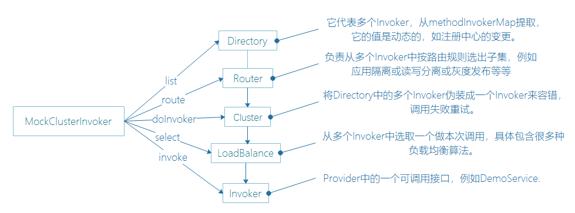

## Dubbo集群容错架构分析

接下来分析Consumer的请求调用原理。以运行方式启动provider，以debug模式启动consumer。

我们在DemoConsumer类中打断点作为起点来跟踪具体的调用：

```java
public class DemoAction {

    private DemoService demoService;

    public void setDemoService(DemoService demoService) {
        this.demoService = demoService;
    }

    public void start() throws Exception {
        for (int i = 0; i < Integer.MAX_VALUE; i++) {
            try {
                String hello = demoService.sayHello("world" + i);
                System.out.println("[" + new SimpleDateFormat("HH:mm:ss").format(new Date()) + "] " + hello);
            } catch (Exception e) {
                e.printStackTrace();
            }
            Thread.sleep(2000);
        }
    }
}
```

在idea中断点状态下查看表达式的值，可以使用Alt+F8查看。

从demoService.sayHello()说起：

```java
demoService.sayHello("world" + i)
-->InvokerInvocationHandler.invoke
  -->invoker.invoke(new RpcInvocation(method, args))
    -->RpcInvocation//所有请求参数都会转换为RpcInvocation
    -->MockClusterInvoker.invoke(Invocation invocation) //1.进入集群
      -->invoker.invoke(invocation)  //RpcInvocation [methodName=sayHello, parameterTypes=[class java.lang.String], arguments=[world0], attachments={}]
        -->AbstractClusterInvoker.invoke(final Invocation invocation)
          -->list(invocation)
            -->directory.list(invocation)//2.进入目录查找   从this.methodInvokerMap里面查找一个Invoker
              -->AbstractDirectory.list(Invocation invocation)
                -->doList(invocation)
                  -->RegistryDirectory.doList(Invocation invocation)// 从this.methodInvokerMap里面查找一个Invoker
                -->router.route //3.进入路由 
                  -->MockInvokersSelector.route(final List<Invoker<T>> invokers, URL url, final Invocation invocation)
                    -->getNormalInvokers(final List<Invoker<T>> invokers)
          -->ExtensionLoader.getExtensionLoader(LoadBalance.class).getExtension("roundrobin")
          -->return doInvoke(invocation, invokers, loadbalance)
            -->FailoverClusterInvoker.doInvoke(Invocation invocation, final List<Invoker<T>> invokers, LoadBalance loadbalance)
              -->select(loadbalance, invocation, copyinvokers, invoked) //4.进入负载均衡
                -->AbstractClusterInvoker.select //使用loadbalance选择invoker. a)先lb选择，如果在selected列表中 或者 不可用且做检验时，进入下一步(重选),否则直接返回</br> * b)重选验证规则：selected > available .保证重选出的结果尽量不在select中，并且是可用的
                  -->doselect(loadbalance, invocation, invokers, selected) ////如果只有一个invoker，则直接返回该invoker；如果有两个则退化成轮训；如果更多则做负载均衡如下：
                    -->loadbalance.select
                      -->AbstractLoadBalance.select  //默认做loadbalance
                        -->doSelect
                          -->RoundRobinLoadBalance.doSelect 
                            -->return invokers.get(currentSequence % length)//取模轮循
              -->Result result = invoker.invoke(invocation)
```

集群容错的基本流程：



